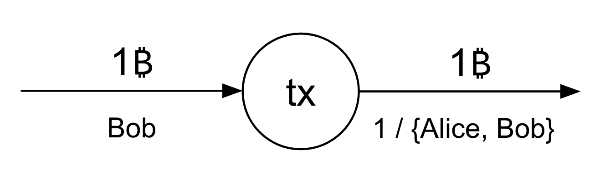
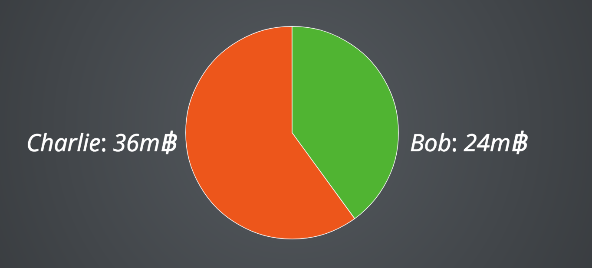
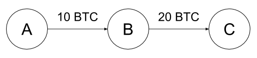
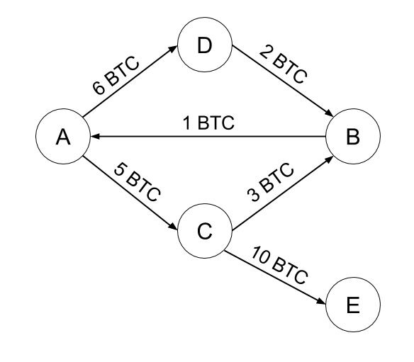
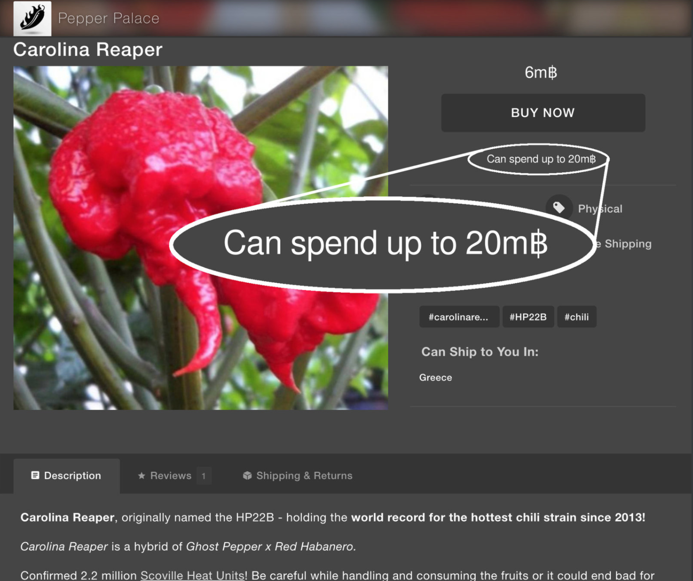
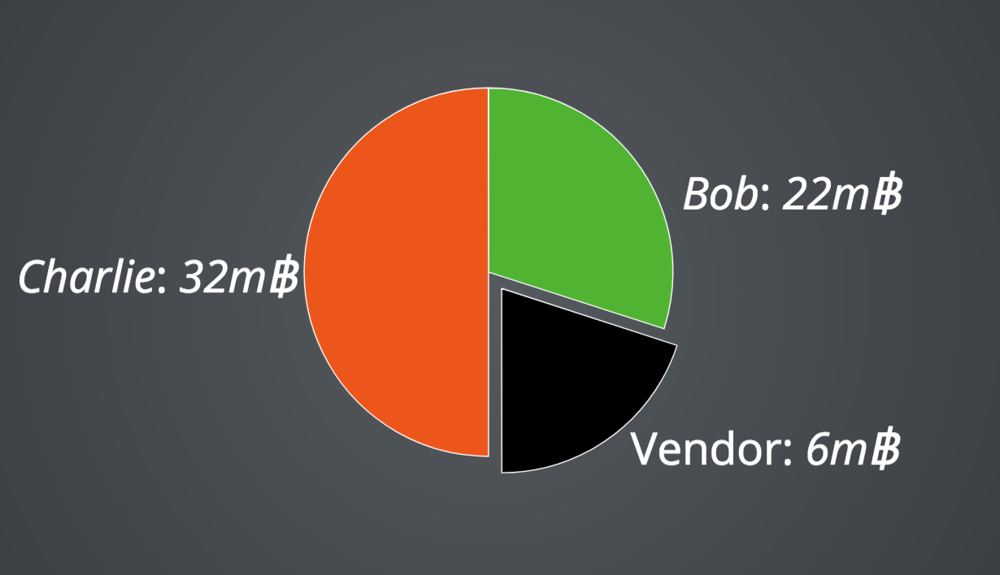

# Trust is Risk: A decentralized trust system

One of the foundational problems of a decentralized marketplace is that of
trust. It's an inherently difficult problem: How can you trade with someone who
could, in principle, be completely anonymous?

In this article, we provide a novel answer to that question, something we call
Trust is Risk. It's a new approach to solve the problem that we're exploring and
we'd like to illustrate our ideas to the community and solicit your feedback.

This post is going to give an explanation of what Trust Is Risk is and how it
works with quite some detail. This post is accessible to anyone. We don't have
any math here. But if you're interested in all the deep details, I'm providing
links to our papers in the last section that you can look at. Sam Patterson also
wrote a [short introduction to Trust Is Risk](...), which covers the same ideas
presented here, but gives a shorter high level overview.

This is novel research work we've been doing that has never been presented
before outside of academic conferences. We'd greatly appreciate your feedback
and constructive criticism of our ideas.

Before we begin, a disclaimer: Trust Is Risk is an exploratory subject.
OpenBazaar is considering it for research, but is not yet committed to adopting
it. More work is needed to evaluate if this system can work in practice.

## The problem and previous attempts at solving it

In a traditional brick-and-mortar store setting, you have certain insurances
that will let you transact safely. If something goes wrong, for example the
store rips you off, you have a whole legal arsenal that you can bring against
the store. But we don't have (and perhaps don't want to have) that luxury in a
decentralized marketplace when people can anonymously connect through
[Tor](https://www.torproject.org) or use cryptocoins that ensure privacy such as
[monero](https://getmonero.org/) or [zcash](https://z.cash/) (which OpenBazaar
[already
supports](https://blog.openbazaar.org/openbazaar-1-1-10-released-purchase-with-ether-monero-and-more-via-shapeshift-io-integration/)).
Besides, if we allowed people to be accountable towards traditional courts and
law, we're opening up pandora's box in letting governments interfere by making
their own laws about what's "cheating in a transaction" and what isn't, which
leaves room for censorship, something OpenBazaar always wanted to avoid – which
is why from OpenBazaar's inception we considered [malicious governments as part
of our threat model](https://blog.openbazaar.org/openbazaar-threat-model/).

Brick-and-mortar stores also have a certain cost to set up and you expect them
to be there the next day for accountability. You can literally walk up to a
store that sold you a faulty phone and ask for your money back. But OpenBazaar
stores can appear out of nowhere and disappear in minutes. We gave a lot of
thought to these features of the physical world during the first versions of
OpenBazaar and came up with [reputation
pledges](https://blog.openbazaar.org/proof-of-burn-and-reputation-pledges/) and
implemented one of the first [production proof-of-burn systems for identity
creation](https://blog.openbazaar.org/why-proof-of-burn/). But people feel very
uncomfortable burning money to set up a digital store and we discovered some
alternative ideas like donating to charity or miners can't work out securely.

Here are some critical questions: If you're a buyer, how do you know that when
you give them the money, they're going to send you the product? Or if you're a
vendor, how do you know that when you ship them the product, they'll give you
the money they promised? Of course you can use transaction-based escrows such as
2-of-2 or 2-of-3 transactions or MAD, some of which OpenBazaar already
implements. But the problem remains: What if as a buyer you use a 2-of-2
transaction and upon receiving the product you finalize your funds, only to find
out days later that it was of bad quality and broke down?

Another idea is to use a web-of-trust and I wrote extensively about the
potential of using it in OpenBazaar in [my master
thesis](https://dspace.lib.ntua.gr/bitstream/handle/123456789/43147/pseudonymous-trust-2.pdf?sequence=1)
(of which [the shorter
version](https://gist.github.com/dionyziz/e3b296861175e0ebea4b) is much more
palatable). But the problem there, as [with
GPG](https://en.wikipedia.org/wiki/Web_of_trust), is that trust is arbitrary:
it's *just a number* and everybody has a different idea about how much to trust
others and what trust means. For example, some people are very diligent about
giving out trust, while others aren't. An arbitrary trust scale doesn't mean the
same to everybody. And so the problem remains unsolved.

## Sybil attacks and stars

Currently OpenBazaar uses a reputation system which is based on ratings and
stars. This is a system widely employed by centralized markets as well, from
eBay to Facebook Marketplaces. The idea is to let other people rate you from 1★
to 5★ as a buyer or as a vendor after a transaction is completed. Then, an
average can be extracted and displayed for everyone.

This star-based system is quite attractive due to its simplicity and ease of
understanding. Centralized marketplaces can afford this system, because they can
refactor it and censor users at will if they gauge that people are misbehaving.
They can also employ secret heuristic mechanisms to detect and punish
wrongdoing. However, a decentralized market does not have such an option, as the
code and exact inner workings must be open.

This opens up a star-based system to [Sybil
attacks](https://en.wikipedia.org/wiki/Sybil_attack). In this attack, a
malicious vendor works as follows: They create multiple fake "buyer" accounts
which perform transactions with the vendor. They then have the buyer accounts
positively rate the vendor, increasing their star rating. The fact that a
transaction is required prior to rating someone does not help defend against
this attack. The seller simply moves funds among different Bitcoin addresses all
of which they control. As OpenBazaar [does not require paying any
fees](https://openbazaar.zendesk.com/hc/en-us/articles/203196635-Are-there-fees-to-use-OpenBazaar-)
this is essentially free (except for Bitcoin transaction fees).

Many naïve ideas can be proposed for avoiding Sybil attacks. Here's one: If a
vendor receives many ratings simultaneously from users that all have newly
created accounts, then these ratings can be discounted. Here's another one: A
buyer must have made a minimum of 5 other purchases before they can rate this
vendor. Here's yet another: A buyer must have already rated *another* vendor
prior to having his ratings count. And one more: If the buyer and seller form an
isolated strongly connected "island" of ratings (a so-called clique), then the
ratings should be discounted. These proposals are lucrative, but can't possibly
work. The rules for deciding which ratings are good and which ones are bad must
be published in the open source code of the project. Subsequently, the malicious
vendor can make sure they bypass such rules. For example, they will make sure
they let their accounts "mature" before rating, they will create several fake
vendor accounts so that their fake sellers can create ratings towards the fake
vendors prior to making ratings to the real vendor and they will avoid forming a
"clique" of ratings by not having everyone rate everyone, but rather mimic the
way real people rate real vendors in terms of amount of ratings, connectedness,
and so forth. The same problems arise if you try to filter by IP address or
require that people run a different OpenBazaar node version or OS version. It's
a futile cat-and-mouse game.

## Trusting people

The core idea of Trust is Risk is quite simple. We believe this is the right
approach for handling decentralized trust. Here it is.

Suppose Bob shares a bank account with her friend Alice. He puts 10€ in it,
which are his own, but just trusts Alice not to take it. Because Alice is his
friend, she doesn't take it. While Alice *can always* take it, she chooses not
to. Even though it's put in a shared account, Bob's money is always Bob's and he
can always take it too.

In Bitcoin, we can do the same thing with a transaction that has a 1-of-2
multisig output. A 1-of-2 multisig output means that the money is spendable by
either one of the two participants on their own, Alice or Bob. Alice doesn't
need Bob's permission to spend and Bob doesn't need Alice's permission to spend.
Here's what that looks like in the Bitcoin transaction graph:

Here, Bob has created a transaction into which he pays 1 BTC so that the money
can now belong to an account shared between Alice and Bob. Whenever we mention
a "shared account" in this post, we mean such 1-of-2 multisig transaction
outputs.

We call this a *trust transaction*, because Bob trusts Alice with his money. The
use of such transactions, reminiscent of *lines-of-credit* in more traditional settings,
for the purpose of establishing trust was a great idea invented by OpenBazaar
co-founder Washington Sanchez in his post [Peer-to-Peer Lending on
OpenBazaar](https://gist.github.com/drwasho/2c40b91e169f55988618#part-3-web-of-credit).

Suppose now, in this limited setting, that Bob wishes to purchase something from
Alice, and that Bob has already entrusted Alice with 1 coin at an earlier moment in
time. If what he wants to buy from Alice is worth 1 coin, then he can do it as
follows: He takes the money out of the shared account and pays it directly to
Alice's account (or simply tells Alice that it's fine to take it out of the
shared account). Then Alice can get paid and ship the product.

That doesn't sound like a big deal, because Bob and Alice were already friends,
but think about what just happened: Bob was *willingly* trusting Alice with some
money, a trust decision he took in the past. If that trust decision on Bob's
side was the right call, then Alice will not cheat on him and will not take the
money out of the account. Therefore, merely by having the money in a shared
account, Bob has established an amount of trust for Alice.

He can then use that money and buy something from Alice, knowing that Alice
won't steal from him in the product trade. Why? Because **if Alice had wanted to
steal from him, she could've done so previously anyway**. We call this property
*risk invariance*, because Bob's risk exposure towards Alice does not change
before and after the purchase. Before the purchase, Bob was willingly taking a
risk of 1 coin, because it was in a shared account with Alice. After the
purchase, Bob is again taking a risk of 1 coin, because he is waiting for a
product worth 1 coin to arrive, but has removed the money from the shared
account. In both cases, Bob was trusting Alice by risking 1 coin and nothing
changed. When Bob receives the product, this closes the trade and he can
replenish the trust by opening a new shared account with Alice, if he wants to.

## The Trust is Risk wallet

Based on the very simple idea above, we know that people have friends that they
are willing to trust financially. This is a very different situation from more
traditional webs-of-trust, such as GPG, where trust is an arbitrary numeric
value. Now trust is established as a monetary value, it is denominated in
bitcoin, and everyone is equal in it. If Alice trusts Bob with 1 coin, and
Charlie trusts Dave with 1 coin, that's 1 coin everywhere. It has the same
purchasing power. In this sense, we utilize [money's unit of account
property](https://www.cliffsnotes.com/study-guides/economics/money-and-banking/functions-of-money)
to equalize what trust means for different people. Yes, maybe different people
are less willing to trust others, but we now have a quantifiable means of
establishing how much they trust each other without ever having to know their
personality intricacies. We thus leverage the objective nature of money in order
to "objectify" trust.

Imagine now that we provide a new generation of bitcoin wallets. This wallet is
called the Trust is Risk wallet. You can move money back and forth between your
traditional wallet and your Trust is Risk wallet to your heart's content. But
your Trust is Risk wallet is different: In it, your money can be put in shared
accounts with your friends via trust transactions. So, for example, if Alice has
60 mBTC stored in her Trust is Risk wallet, she could have allocated 36 mBTC of
it to Charlie and 24 mBTC of it to Bob. That money is under risk: Alice is
choosing her friends to put some of her own money under their control, and
hopefully she's choosing wisely. Here's how her wallet could display her
portfolio:

Here, she's putting 36 mBTC in a shared account with Charlie and another 24 mBTC
in a shared account with Bob, for a total of 60 mBTC.

Trust transactions have an additional cryptographic property: They can be used
to prove to third parties that a trust relationship exists between two people.
Hence, if Alice and Bob maintain a shared account where Alice's money is stored,
they can publicize the respective Bitcoin transaction and everybody can know
that Alice trusts Bob a certain amount of money. For reasons that will become
clear below, we want to publicize all these trust relationships in OpenBazaar by
default. One easy way to do that is to associate a fixed Bitcoin address with
each OpenBazaar node and use that as-is in all trust transactions. There are
also better ways of doing it using unique addresses that are verified to belong
to their respective owners with a signature. Showing these transactions to third
parties constitutes a *proof-of-trust* and is a powerful new primitive.

## Trust transitivity

You may be asking: Why would I ever put my money in a Trust is Risk wallet? That
sounds like a silly, unnecessary risk. But you get a unique benefit from that.
If you're willing to risk some money by having some exposure to known friends,
then we can solve the decentralized trust problem. This is the crux of this
reputation system.

Here's how it works: You trust some money to each of your friends. They trust
some money to their own friends and perhaps back to you. Their friends trust
their own friends, and so on, forming a big network of trust similar to
cryptographic webs-of-trust. However, this network is now associated with
financial values.

Technically, we say that the web-of-trust forms a *trust graph* of people
connected through lines-of-credit. Here's how that graph looks like if Alice
trusts Bob with 10 coins and Bob trusts Charlie with 20 coins:

Unlike the previous graph where we were showing a Bitcoin transaction with
inputs and outputs, here the circles correspond to OpenBazaar accounts and the
arrows correspond to lines-of-credit (also known as *direct trusts*) extended
between them.

But now that we have two steps in the trust graph, something interesting
happens: Alice not only trusted Bob with her money, but she also trusted Bob
**about his financial trust decisions**. Imagine the following case: say Charlie
decides to steal the money that Bob has deposited into their shared account. In
this case Bob has incorrectly trusted Charlie by putting his money into their
shared account. Then Bob has a spectrum of options with two extremes. In the
first extreme, Bob can, in turn, take Alice's money deposited in the account
shared between Alice and Bob in order to replenish his loss. Of course, this is
a worst-case scenario for Alice. The other extreme option for Bob is to decide
to absorb the loss, which is a better scenario for Alice. Nevertheless, Alice is
in practice exposed to some risk due to Charlie's behavior through her trust in
Bob. She not only has entrusted Bob with her money in good faith that he won't
steal it, but also gone a step further, trusting him with her money to make his
own investments. But in any case, Alice's liability is limited to the amount she
has put in that account she shared with Bob. She can explicitly set a bound on
how much Bob's mishaps can cost her.

These two distinct options for Bob often arise in real-world economic scenarios.
Suppose there is a client, an intermediary and a producer. The client entrusts
some value to the intermediary so that the latter can buy the desired product
from the producer and deliver it to the client. The intermediary in turn
entrusts an equal value to the producer, who needs the value upfront to be able
to complete the production process. However, for whatever reason, the producer
eventually does not ship the product and neither reimburses its value. This
could be due to bankruptcy or an illegal decision to exit the market with an
unfair benefit. The intermediary can then choose either to reimburse the client
and suffer the loss, or refuse to return the money and perhaps lose the client's
trust. Because losses can be passed down the line, we call this a *transitive
trust game*.

Trust transitivity, especially in a decentralized financial setting, has been
explored and supported by [empirical sociological
research](http://www.personal.ceu.hu/staff/Adam_Szeidl/papers/socialcollateral.pdf)
of lending networks. They have independently discovered that our results, which
we prove mathematically, empirically arise in real networks of people.

## The flow of money

Just as an example, here's what a slightly more complex trust graph looks like:

Here we have an interesting case of a trust cycle: `A` trusts `D`, who trusts
`B`, who trusts `A`.

We've set up our trust graph. Now suppose you, the user of OpenBazaar, have a
Trust is Risk wallet and some of your money is deposited to accounts shared with
your friends. And, now, suppose you find some vendor who is also participating
in the Trust is Risk network through his own wallet. Of course, you don't trust
that vendor directly. However, there may be indirect lines-of-credit extended to
the vendor. Through your financial decision to trust your friends, a move you've
made comfortably already knowing who they are, you have taken some calculated
risk towards some pseudonymous vendor whom you've never met. In fact, since the
trust transactions are public, your OpenBazaar node can calculate exactly how
much this risk is. Calculating the exact risk value is not as easy as looking at
each line-of-credit as we did in the simple case with just three people above,
but regardless there's a formula we can use to automatically evaluate it. This
evaluation of risk exposure is performed using something we call the *trust flow
theorem*. The risk is an exact value measured in bitcoin.

Here's a fun trivia fact: The way we evaluate the total risk exposure of a buyer
towards a vendor is using a fascinating classical graph theory algorithm from
the 1950s called the *maximum flow algorithm* which was invented by Lester Ford
and Delbert Fulkerson. They invented this algorithm to solve a completely
different problem – [the efficiency of the Soviet railway
network](http://homepages.cwi.nl/~lex/files/histtrpclean.pdf).

Once we've calculated how much risk you already have towards
a vendor, we can perform the same reasoning as we did previously:

1. You **willingly** trusted money to your friends.
1. This indirectly exposed you to a certain financial risk towards the vendor,
   which we calculated.
1. If that vendor was evil and wanted to leave the market with an unfair
   advantage, which, in the worst case, could cost you your money, they could have already done so.
1. You can now safely buy from that vendor up to a certain value without
   incurring additional risk – to pay for the product, just use some of your
   money from the account shared with your friend.

In order to buy from that vendor, you want to keep your risk the same prior to
making a purchase and after completing a purchase. We have proven that this is
possible in our *risk invariance theorem*, as long as your risk towards a vendor
is higher than the price of the good you wish to purchase. Therefore, your Trust
is Risk wallet will automatically pay the vendor by reducing some money you have
deposited in the accounts shared with your friends and use that money to pay the
vendor directly. The calculation of where to take money from in order to keep
your risk constant is performed using a *trust redistribution algorithm*. For
the user, it will be a simple matter of seeing the money leaving some shared
friends' accounts and paying the vendor.

One thing to understand is that this trust system is a new paradigm. It does not
actively protect the user from mishaps in any way. There's no way to flag the
purchase as fake or talk to an escrow to have a conflict resolved. The only
security insurance provided by the system is risk invariance: We're only
ensuring that the risk you were taking by trusting money to your friends is the
same as the risk you are taking by making a purchase from an unknown entity.
**If** (and that's a big if) you have chosen to trust your friends with your
money wisely, **only then** we make sure that the purchase is safe. But if the
vendor decides to screw you, there's nothing we can do about it, except show you
a trace of why the vendor was deemed trustworthy, pointing exactly to whom of
your friends you should stop trusting now (or whom of *their* friends they
should stop trusting, and so on).

Unlike stars, the trust that the buyer is seeing for the vendor is
**personalized**. We call this *projected trust*, a trust value that is
potentially different when two different buyers are browsing the shop of the
same vendor. This is a recurring theme in our work. We conjecture, although we
have not proven, that secure decentralized trust systems must necessarily use
some form of projected trust.

## Putting it together

As you can see, we have approached the problem of *trust*, a broad and ambiguous
concept, by mathematically defining it to be equal to *financial risk*. When
Alice puts money in an account shared with Bob, we say that she *directly
trusts* Bob. But we previously concluded that pseudonymous people far away in
the network towards whom Alice has never extended any direct trust can still
behave in a way that can cost Alice money – if she made a wrong decision when
she decided to trust her friends. We call these *indirect trusts*.

This may all sound complicated, but the end user experience is simple. Let's go
through a purchase of some goods on an imaginary new version of OpenBazaar to
see how this could work.

We'll trace Alice's steps from joining the network to successfully completing
a purchase. Suppose initially all her coins, say 100 mBTC, are under her
exclusive control in a traditional bitcoin wallet.

Two trustworthy friends, Bob and Charlie, persuade her to try out Trust Is Risk.
She installs the Trust Is Risk wallet, perhaps even shipped as part of the
OpenBazaar program, and migrates 60 mBTC of her 100 mBTC from her regular
wallet, entrusting 24 mBTC to Bob and 36 mBTC to Charlie. She now exclusively
controls 40 mBTC. She is risking 60 mBTC to which she has full but not exclusive
access in exchange for being part of the network. Alice's wallet is represented
by the pie chart we went through above.

A few days later, she discovers an online pepper shop, Pepper Palace, owned by
Dean, also a member of Trust Is Risk. She finds a nice Carolina Reaper pepper
that costs 6 mBTC and checks Dean's trustworthiness through her new wallet.
Suppose Dean is deemed trustworthy up to 20 mBTC. Since 6 mBTC ≤ 20 mBTC, she
confidently proceeds to purchase the pepper with her new wallet.

We call these "20 mBTC" the *allowance* our system gives to Alice for making
purchases from Dean. If she spends any money up to that amount, we can give risk
invariance insurances. Spend money beyond that point and she incurs additional
risk, which she can of course choose to take.

Hey, by the way, if you're into peppers, this is a real product you can
currently [buy on
OpenBazaar](https://bazaarbay.org/1233d41c55840f2957dbc9c7cd7dd781d2983003/listing/af69481de7187c6c5fbb31897b3b0180f3a8b2bc)! 🌶

She can then see in her wallet that her exclusive coins have remained 40
mBTC. But the coins from her shared account with Charlie have been automatically
reduced by 4 mBTC and are now down to 32 mBTC. And the coins in her shared
account with Bob have been reduced by 2 mBTC and are now down to 22 mBTC. Dean
has been paid 6 mBTC, equal to the value of the pepper. Also, her purchase is
marked as pending. Under the hood, her wallet redistributed her entrusted coins
in a way that ensures Dean has been paid with coins equal to the value of the
purchased item and that her risk towards him has remained invariant. The "risk
invariance" property is what her wallet has tried to maintain by redistributing
the funds in this particular manner – always making sure she's not exposed to
more risk than before.

Eventually all goes well and the pepper reaches Alice. Through her wallet, she
marks the purchase as successful.

This lets the system replenish the reduced trust to Bob and Charlie, setting the
entrusted coins to 24 mBTC and 36 mBTC respectively once again by moving funds
from Alice's exclusive account into the shared accounts. Alice now exclusively
owns 34 mBTC. Thus, she can now use a total of 94 mBTC, which is expected, since
she had to pay 6 mBTC for the pepper.

## Sybil resilience

The careful reader will have noticed that this system is no longer Sybil-attackable. This stems directly from the fact that indirect trust is projected and is based on risk.

What this means in short is that if I am a prospective buyer and have a certain
amount of indirect trust (or risk) towards a certain group of malicious vendors,
there is no way they can cooperate to increase the total trust I see towards
them. Regardless of how many fake trust connections they make between each other
and towards others and regardless of how many new fake accounts they create, the
trust I will have towards them will be the same and bounded by a specific value.

To see why, think about how it works in a simple situation with just a single
step. Each trust transaction creates a limited liability. If Alice directly
trusts Bob with 1 coin, there's no way he can increase that by trusting others
or creating fake accounts. He can't create a fake shop that Alice trusts more
than 1 coin, unless he solicits others to really trust the new shop more. It
doesn't matter how many good transactions he makes with himself using his fake
buyers and sellers. It doesn't even matter how many lines-of-credit he extends
to himself. Adding more accounts and trust transactions himself will do him no
good. We formalize precisely what this means and prove this fact in our *sybil
resilience theorem*. Intuitively, the only way to increase Alice's trust towards
him is to persuade people Alice trusts (or Alice herself) that he is
trustworthy. He can achieve this for example by building a valid and dependable
business.

## Conclusion

This concludes the two pillars of security in our system: On the one hand, we
give the user risk invariance, the insurance that they're not exposed to any
more risk than they were willingly exposing themselves to. On the other hand, we
give the whole system sybil resilience, meaning there's no benefit in creating
fake accounts.

To summarize, we have proposed a new form of bitcoin wallet where people use
shared accounts to take calculated risk towards their friends. This augments the
OpenBazaar user interface with showing an "allowance" amount calculated behind
the scenes using trust flow algorithms. If the user respects our
recommendations, they incur no additional risk from making a purchase. For the
completion of a purchase, the wallet automatically redistributes the funds in
the Trust Is Risk wallet. The user can always replenish their wallet by putting
in more money. The system remains resilient to Sybil attacks.

We hope one day a system like this can be made part of OpenBazaar and used by
people worldwide to make safer trades in a decentralized manner without having to
worry about their money being lost or stolen.

## More resources and acknowledgements

We've been working on these concepts for quite a long time now. These results
have been developed at the [Decrypto Lab](http://github.com/decrypto-org/), a
loosely connected decentralized lab which bridges the [Crypto.Sec
group](https://crypto.di.uoa.gr) at the University of Athens, the [Blockchain
Technology
Lab](http://www.ed.ac.uk/informatics/news-events/stories/beyond-bitcoiniohk-and-university-of-edinburgh)
at the University of Edinburgh, the [Department of
Computing](http://www.imperial.ac.uk/computing) at Imperial College London,
[Corelab](http://corelab.ntua.gr/) at the National Technical University of
Athens and other schools and laboratories with interest in the subject.

A lot of work remains. The question of whether these security properties can be
achieved without disclosing the whole trust graph to everyone is a burning open
research challenge. A formal game theoretic analysis of the system would also be
a much appreciated addition.

This is collaborative work with my colleagues:

* [Orfeas Stefanos Thyfronitis
  Litos](https://www.inf.ed.ac.uk/people/students/Orfeas_Thyfronitis_Litos.html),
  currently a PhD student at the University of Edinburgh worked on Trust Is Risk
  for completing his master thesis at the National Technical University of Athens.
  You can read [his whole
  thesis](https://github.com/decrypto-org/TrustIsRisk/raw/master/thesis/wholethesis.pdf) [PDF]
  (of more than 70 pages), which goes in a lot of depth about all the theoretical material I
  presented here. He worked on most of the formalisms of the proofs and he
  developed all the trust redistribution algorithms. He also has [a presentation of his thesis](https://github.com/decrypto-org/TrustIsRisk/raw/master/presentations/thesisDefense23-1-2017/thesisDefense23-1-2017desktop.odp) [ODP].

* [Christos Porios](https://github.com/tech-no-crat), currently a Software
  Engineer at Google Zurich worked on an implementation of Trust Is Risk as his
  Bachelor thesis for his graduation from Imperial College London. [His
  whole thesis](https://github.com/decrypto-org/TrustIsRisk/blob/master/thesis-chrisp/decentralized-trust.pdf) [PDF] (of 50 pages)
  is on the implementation of Trust is Risk and contains all the little details
  of how to get it done on top of Bitcoin. He also has [a presentation of his thesis](https://github.com/decrypto-org/TrustIsRisk/raw/master/thesis-chrisp/presentation.pdf) [PDF].

I was greatly honored to work with both of them.

I'm [Dionysis
Zindros](https://dionyziz.com/), currently a cryptography/blockchains PhD
student at the University of Athens and one of the original OpenBazaar
co-founders.

Don't take my word for all our claims and theorems. You can read all the formal
math and proofs in our paper, [Trust is Risk: A Decentralized Financial Trust
Platform](https://github.com/decrypto-org/TrustIsRisk/raw/master/fc17.pdf) [PDF]. We
also have a more concise [proceedings
version](https://github.com/decrypto-org/TrustIsRisk/raw/master/fc17-proceedings.pdf) [PDF].
The paper was peer-reviewed and published in the [Financial Cryptography and
Data Security 2017](http://fc17.ifca.ai/program.html) conference in Malta. [The
slides of our presentation](http://slides.com/orfeas/fc17) are also available.
We work in an open research setting. All our new experimental attempts at
extending our theory are available on [our theory GitHub
repository](https://github.com/decrypto-org/TrustIsRisk) where you can
participate.

We have started working on a first version of a node.js implementation [in
our implementation GitHub
repository](https://github.com/decrypto-org/TrustIsRisk.js), although most of
the code is currently in pull requests. We're also actively working on an SPV
implementation.

All of this work was made possible through some very generous financing of our
research by our partners, [OB1](https://ob1.io/) (the OpenBazaar company) and
[FrostWire](http://www.frostwire.com/) – both  have provided continuous support
both financially but also technically. The whole team has inspired us with their
work towards making trade free. [Brian
Hoffman](https://twitter.com/brianchoffman)'s, [Sam
Patterson](https://twitter.com/SamuelPatt)'s and [Angel
Leon](https://twitter.com/gubatron)'s valuable input has helped us focus our
research on applied topics that can be used in the real world to solve real
problems. And of course our work is based on the great ideas by [Washington
Sanchez](https://twitter.com/drwasho) without whom this project wouldn't have
been born. We're honoured to have [Aggelos Kiayias](http://www.kiayias.com/) as
our PhD advisor, who has always encouraged us to become better scientists by
understanding the problem and all the formal details behind it. Finally, this
work was also made possible with the generous financing by
[IOHK](https://iohk.io/) and [ERC](https://erc.europa.eu/).
